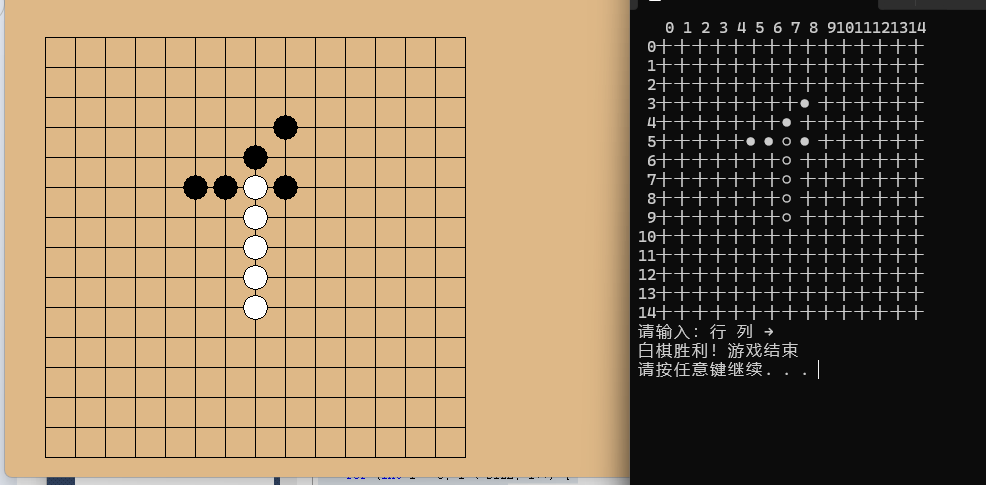

&#x20;Gomoku - 五子棋小游戏 🎮

📝 项目介绍

这是一个使用 C 语言编写的五子棋对弈程序。它采用了一种独特的“控制台输入 + 窗口显示”的交互模式：

在 控制台输入坐标（行 0-14，列 0-14）。

在 图形窗口中实时观察棋盘布局。

✨ 主要功能

双人对弈: 支持黑棋（●）与白棋（○）交替下子。

图形化渲染: 使用 EasyX 库绘制棋盘和精美的圆形棋子。

智能判胜: 具备水平、垂直、正/反对角线四个方向的连五检测算法。

错误拦截: 自动识别越界坐标及重复下子位置。

🕹️ 操作说明

1\. 运行编译后的程序。

2\. 在控制台看到提示：“请输入：行 列 → ”。

3\. 输入两个数字（中间空格），例如：`7 7`。

4\. 观察图形窗口，棋子会自动落在交叉点上。

5\. 率先在任意方向连成 5 颗棋子的一方获悉胜利。

🛠️ 技术细节

棋盘规模: 15 \\times 15 标准棋盘。

渲染技术: 

&#x20; - 控制台使用 `COORD` 坐标控制。

&#x20; - 图形端使用 `initgraph` 初始化 640x480 像素画布。

\- \*\*核心算法\*\*: `checkWin` 函数通过双向延伸计数法实现快速胜负判定。

