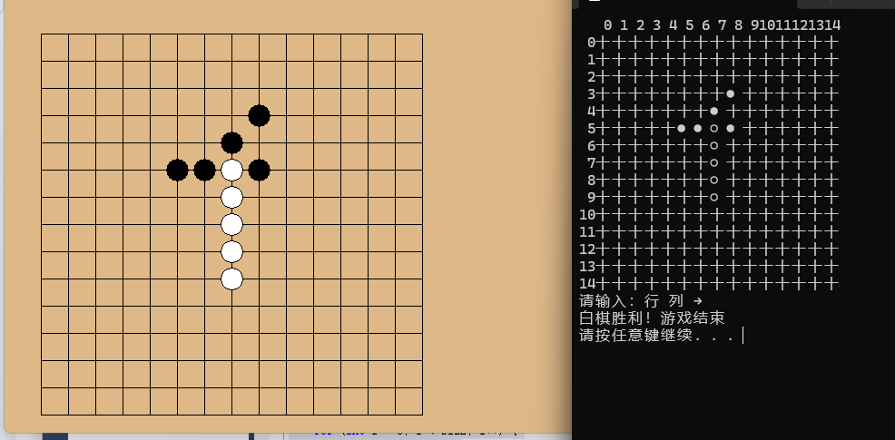

# 五子棋（Gomoku）

一个使用 EasyX 绘制棋盘的本地双人五子棋程序。玩家在控制台输入坐标，图形窗口显示棋盘和棋子。

## 功能

- 15×15 棋盘，黑白双方交替落子；
- 拒绝越界坐标和已经落子的位置；
- 检查横向、纵向和两条对角线上的五连。

## 编译和运行

需要 Windows、Visual Studio 和 [EasyX](https://easyx.cn/)。

1. 在已经配置 EasyX 的 Visual Studio 中创建 C++ 控制台项目。
2. 将 `chess.cpp` 加入项目并编译。
3. 运行后输入 `行 列`，两个坐标的范围都是 `0` 到 `14`，例如 `7 7`。

## 限制

目前只支持本地双人对弈。落子通过控制台输入，图形窗口不处理鼠标操作；由于依赖 EasyX，也不能直接在 Linux 或 macOS 上构建。
