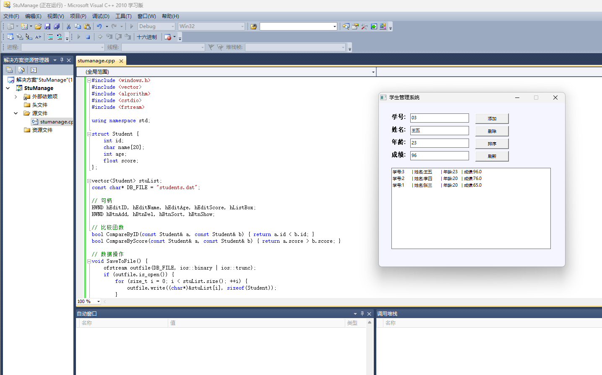

# 学生管理系统（Student System）

使用 Win32 API 和 C++ STL 编写的桌面学生管理程序，代码保留了对 Visual Studio 2010 的兼容。

## 功能

- 添加、删除、修改和查询学生信息；
- 显示全部记录；
- 按学号升序或成绩降序排列；
- 使用 `fstream` 将数据保存在 `students.dat`。

## 编译和运行

1. 在 Visual Studio 2010 或更高版本中创建 Windows 桌面应用程序项目。
2. 将 `stumanage.cpp` 加入项目。
3. 在“项目属性 → 配置属性 → 常规 → 字符集”中选择“使用多字节字符集”。
4. 编译并运行。

程序会在当前工作目录生成 `students.dat`，该文件已被 `.gitignore` 排除。

## 已知问题

- 部分旧字符串字面量有历史编码问题，修复时需要继续兼容 Visual Studio 2010。
- `students.dat` 使用本机二进制结构，不保证跨编译器或跨架构兼容。
